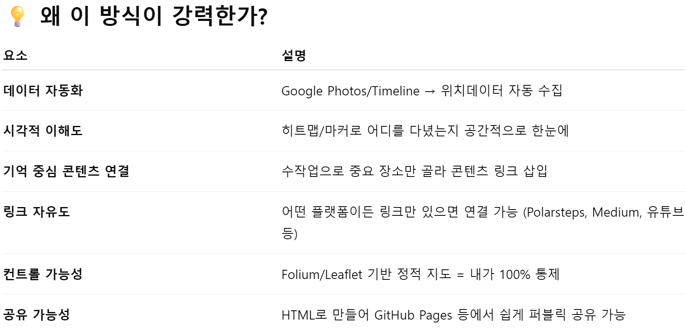

여행관련 흥미로운 웹페이지를 넣어 둔 곳입니다. 

- [맥스마이포인트](https://maxmypoint.com/): 호텔 포인트로 숙박할 수 있는 방이 남아 있는지 확인할 수 있는 웹페이지
- [스킵래그드](https://skiplagged.com/): 더 싼 티켓을 찾을 수 있는지 보여주는 웹페이지

- 내가 가본적있는 곳을 체계적으로 정리해주는 웹페이지. 
[국가 정복 지도](https://matadornetwork.com/travel-map/) 가본국가, 가보지 않은국가를 색칠하는 웹

[여행기록 앱들 비교 해둔 곳](https://alittleadrift.com/travel-journal-apps)

[Polarsteps](https://www.polarsteps.com/) 각각의 여행을 기록하고 통계도 보여주는 사이트, GPS 기능도 있다.

[Day One](https://dayoneapp.com/) 일기장처럼 인상에 남는것을 간편히 기록하기에 좋아보임

[Journey](https://journey.cloud/) 일기장처럼 쓰는데, 지도랑, 기분, 날씨 등을 입력할 수 있음, 200불에 평생 구독 서비스가 있음

[Travel Diaries](https://www.traveldiariesapp.com/en) 여행 전문기자처럼 쓰고, 책자도 만들고 싶다면 사용 할 수 있을듯. 다만 무료 옵션은 없고 월 최소 월1불을 내야한다. 
[Daylio](https://daylio.net/) 그때그대의 감정과, 사진들, 순간들을 간단히 기억하고 나중에 쭉 모아서 볼 수 있는 앱으로 보인다. SNS에 사진 올리는 느낌과 비슷하게 순간의 감정이 중요한 앱

[mapstr](https://en.mapstr.com/) 아주 간단하게 위치와 태그를 걸 수 있는 기능
[MapHub](https://maphub.net/) google의 my maps랑 유사한 서비스 같음.
[TravelMap](https://travelmap.net/) 폴라스텝처럼 이동 경로를 보여주지만 너무 사용하기 불편하고 한국어 친화적이지 못함.

https://wanderlog.com/
https://felt.com/
https://umap.openstreetmap.fr/ko/
https://leafletjs.com/

https://folium.emuplace.app/

[멋진 사진들이 있음](https://www.notesfromtheroad.com/)

