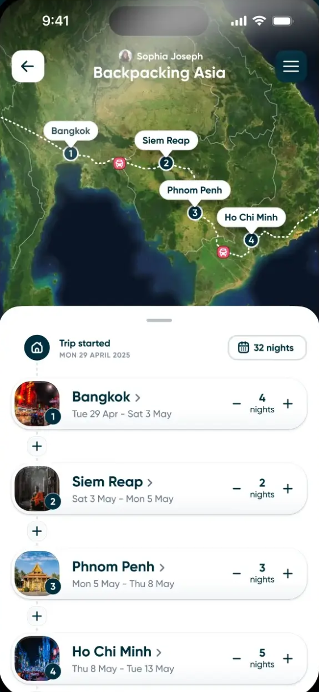

여행관련 흥미로운 웹페이지를 넣어 둔 곳입니다. 

- [맥스마이포인트](https://maxmypoint.com/): 호텔 포인트로 숙박할 수 있는 방이 남아 있는지 확인할 수 있는 웹페이지
- [스킵래그드](https://skiplagged.com/): 더 싼 티켓을 찾을 수 있는지 보여주는 웹페이지

- 내가 가본적있는 곳을 체계적으로 정리해주는 웹페이지. 
[국가 정복 지도](https://matadornetwork.com/travel-map/) 가본국가, 가보지 않은국가를 색칠하는 웹

[여행기록 앱들 비교 해둔 곳](https://alittleadrift.com/travel-journal-apps)

[polarsteps](https://www.polarsteps.com/) 각각의 여행을 기록하고 통계도 보여주는 사이트, GPS 기능도 있다.

[mapstr](https://en.mapstr.com/) 아주 간단하게 위치와 태그를 걸 수 있는 기능
[TravelMap](https://travelmap.net/) 폴라스텝처럼 이동 경로를 보여주지만 너무 사용하기 불편하고 한국어 친화적이지 못함.

[멋진 사진들이 있음](https://www.notesfromtheroad.com/)

